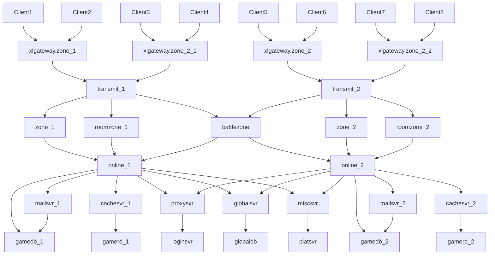
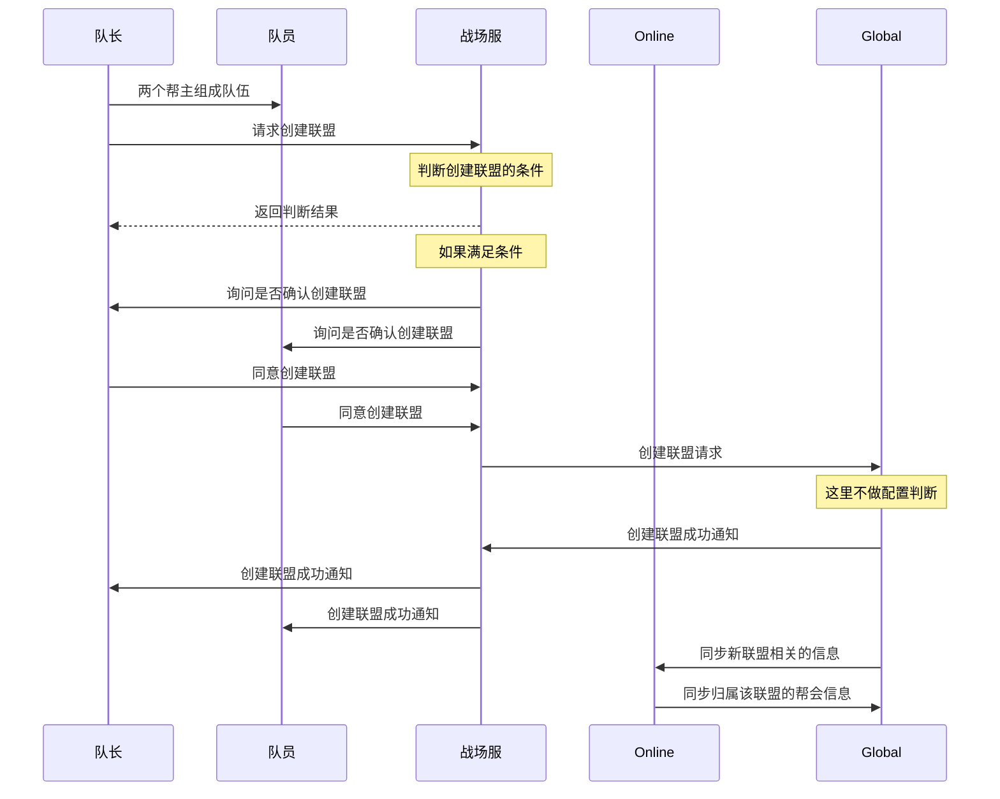
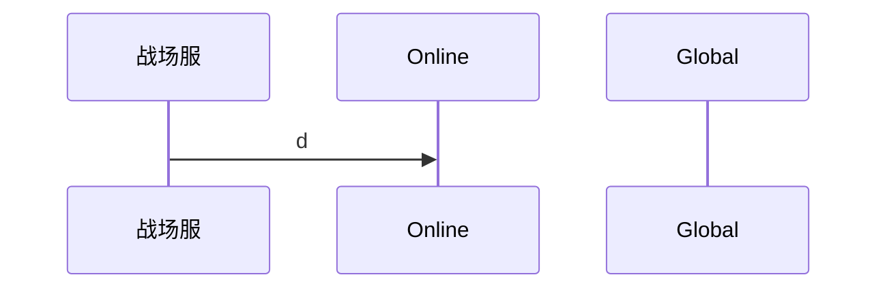

[TOC]

# 联盟系统

## 1.服务器框架

- xlgateway:网关服务，负责对外的网络交互，支持负载均衡
- transmit:网络包中转服务器，网络包转发，统计网络，排队逻辑
- zone:场景服务器，包含大部分游戏逻辑和静态地图
- roomzone:房间服务器，代码同zone，动态地图
- battlezone:跨服服务器，代码同zone，跨服地图
- online:游戏在线服，处理整个服中的一些全局状态
- mailsvr:邮件服务器，处理邮件的逻辑
- cachesvr:缓存服务器，为redis访问提供异步调用
- xlormsvr:数据库服务器，为mysql访问提供异步调用，图中未画出，每一个连接mysql的连线中间都有一个
- 

## 2.联盟相关

### 2.1 创建联盟

### 2.2 联盟信息同步机制

