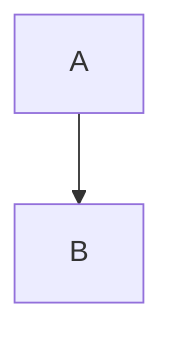

---
title: test
output: pdf_document
---  
  
  
  
#  联盟系统
  
  
##  1.服务器框架
  
  

  
  
```yuml
// {type:deployment}
// {generate:true}
  
[Client1]-[xlgateway.zone_1]
[Client2]-[xlgateway.zone_1]
[Client3]-[xlgateway.zone_2_1]
[Client4]-[xlgateway.zone_2_1]
[xlgateway.zone_1]-[transmit_1]
[xlgateway.zone_2_1]-[transmit_1]
[transmit_1]-[zone_1]
[transmit_1]-[roomzone_1]
[transmit_1]-[battlezone_3]
[battlezone_3]-[note: 跨服{bg:cornsilk}]
[zone_1]-[online_1]
[roomzone_1]-[online_1]
[battlezone_3]-[online_1]
  
[Client5]-[xlgateway.zone_2]
[Client6]-[xlgateway.zone_2]
[Client7]-[xlgateway.zone_2_2]
[Client8]-[xlgateway.zone_2_2]
[xlgateway.zone_2]-[transmit_2]
[xlgateway.zone_2_2]-[transmit_2]
[transmit_2]-[zone_2]
[transmit_2]-[roomzone_2]
[transmit_2]-[battlezone_3]
[zone_2]-[online_2]
[roomzone_2]-[online_2]
[battlezone_3]-[online_2]
  
[online_1]-[mailsvr_1]
[online_1]-[cachesvr_1]
[online_1]-[proxysvr]
[online_1]-[globalsvr]
[online_1]-[miscsvr]
  
[online_2]-[mailsvr_2]
[online_2]-[cachesvr_2]
[online_2]-[proxysvr]
[online_2]-[globalsvr]
[online_2]-[miscsvr]
  
```
  
##  2.联盟相关
  
  