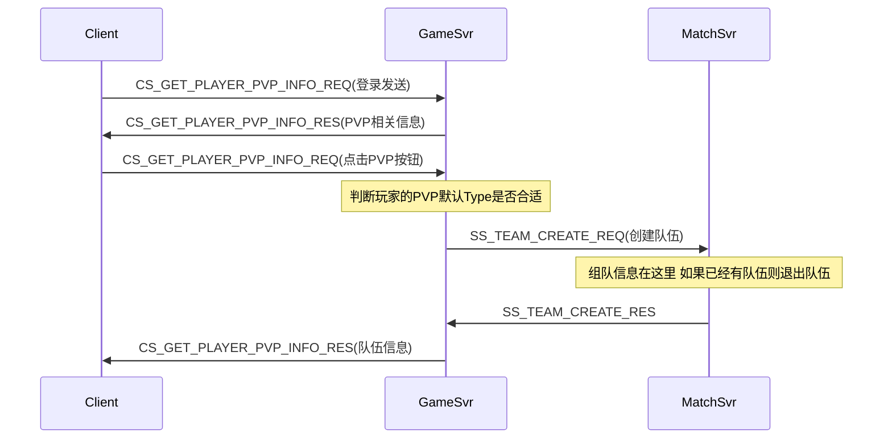
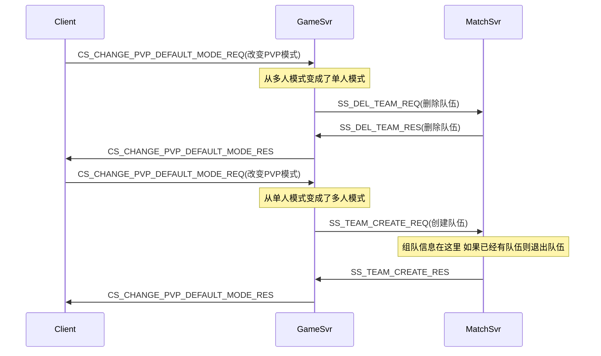
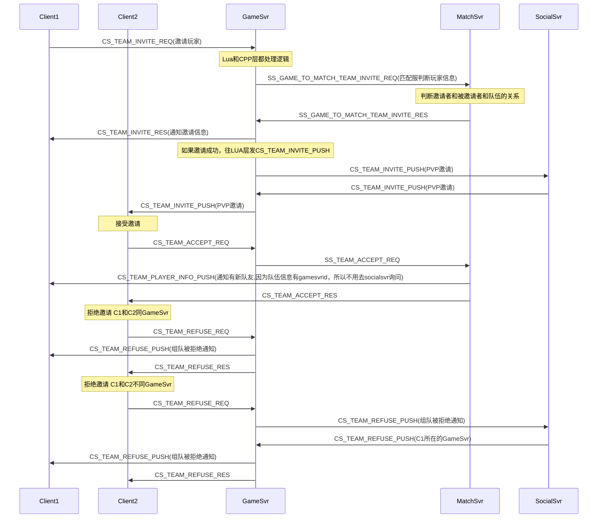
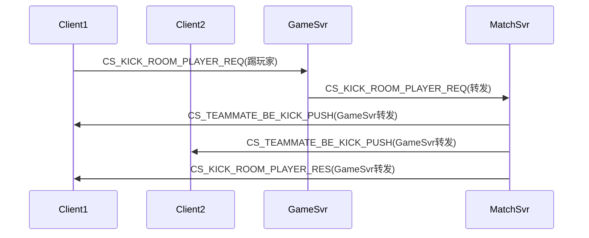
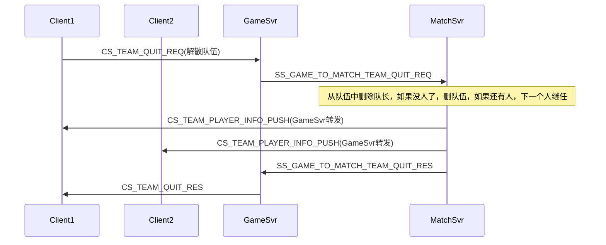
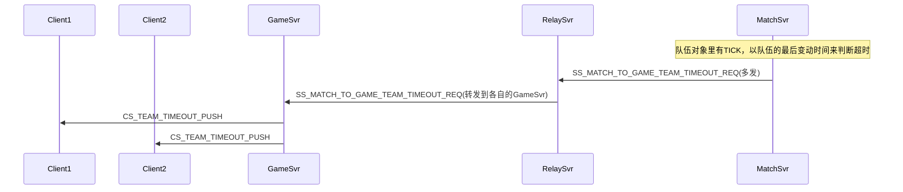
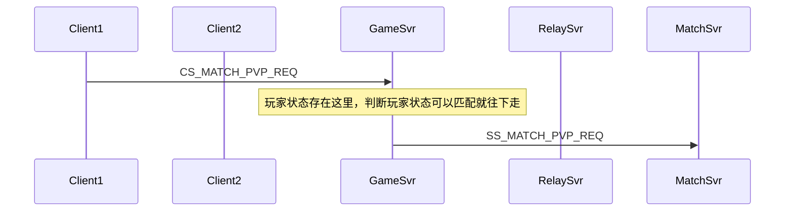

ok //CS请求PVP数据 CS_GET_PLAYER_PVP_INFO_REQ = 13506 --在登录或者点击PVP主入口，向服务器请求PVP数据,在点击PVP主入口发送时，服务器会根据PVP模式判断是否要创建队伍
ok //SS删除队伍 SS_DEL_TEAM_REQ = 30278
ok //SS删除队伍 SS_DEL_TEAM_RES 
ok //CS PVP 组队创建 CS_TEAM_CREATE_REQ = 12535;
ok //CS 队长组队邀请 CS_TEAM_INVITE_REQ = 12501
ok //CS 邀请组队推送 CS_TEAM_INVITE_PUSH = 12520;
ok //CS 队员组队接受 CS_TEAM_ACCEPT_REQ = 12503;
ok //CS 队员组队拒绝 CS_TEAM_REFUSE_REQ = 12513;
ok //CS 队长踢队员出队伍请求 CS_KICK_ROOM_PLAYER_REQ = 12607;
ok //CS 队长踢队员出队伍回包 CS_KICK_ROOM_PLAYER_RES = 12608;
ok //CS 队长踢队员出队伍推送 CS_TEAM_BE_KICKED_PUSH = 13409;
ok //CS 组队更换房主请求 CS_TEAM_CHANGE_LEADER_REQ = 12537;
ok //CS 组队更换房主回包 CS_TEAM_CHANGE_LEADER_RES = 12538;
ok //CS 组队退出, 队长退出则解散队伍 CS_TEAM_QUIT_REQ = 12509;
ok //SS 创建组队超时请求 SS_MATCH_TO_GAME_TEAM_TIMEOUT_REQ = 30085;
ok //CS 队伍超时推送 CS_TEAM_TIMEOUT_PUSH
ok //CS 改变默认选择的PVP模式 CS_CHANGE_PVP_DEFAULT_MODE_REQ = 13508;--玩家更换PVP模式，服务器会根据具体的模式决定是否要创建或者解散队伍
?? //CS 保存PVP备战信息 CS_SAVE_PVP_PREPARE_DATA_REQ = 13436;--玩家更换军团时处理
ok //CS 3V3组队和开房间人员变化推送 CS_TEAM_PLAYER_INFO_PUSH = 12105 --玩家队伍信息改变时推送
ok //CS 玩家更改房间准备状态请求 CS_SET_ROOM_READY_STATUS_REQ = 12605;
ok //CS开始匹配 CS_MATCH_PVP_REQ = 11401;所有玩家

//CS PVP 开始PVP CS_START_PVP_FIGHT_REQ = 11403;旧机制选军团开始时请求一次，loading完再请求一次

//CS pvp战备查询  CS_PVP_BATTLE_REPORT_QUERY_REQ = 12530;旧机制战备数据轮询

//CS PVP Ready 请求 CS_READY_PVP_REQ = 11405;在loading完之后客户端会向服务器发送ready消息

//CS 上报帧hash CS_REPORT_FRAME_HASH_REQ = 11489; 战斗过程中客户端向服务器每5秒定时上报帧的hash。

//SS 匹配成功后创建房间 SS_MATCHSUCC_CREATEROOM_REQ = 30014;匹配成功时gamesvr收到的消息
//SS roomsvr --> gamesvr SS_ROOM_TO_GAME_ENTERROOM_REQ = 30015;匹配成功时gamesvr收到的消息
//CS / 匹配成功推送 CS_MATCH_SUCC_PUSH = 13499;
//SS 匹配成功后到gamesvr拉玩家备战数据 SS_PVP_GET_PLAYER_DATA_REQ

//CS 取消匹配 CS_CANCEL_MATCH_REQ = 11415;
//CS 队长组队取消匹配 CS_TEAM_CANCEL_MATCH_REQ = 12507;
//CS 取消匹配推送 CS_CANCEL_MATCH_PUSH = 13630
//CS 开始匹配推送 CS_MATCH_PVP_PUSH = 13633

//CS 拉取PVP段位奖励信息	CS_PULL_PVP_RANK_REWARD_REQ
//CS 领取PVP段位奖励		CS_GOT_PVP_RANK_REWARD_REQ

//CS 客户端每次登录时重新进入战斗询问推送 CS_PVP_COND_NOTIFY

//开宝箱请求 CS_GET_BOX_ITEM_REQ
//CS 大逃杀结算		CS_BIG_ESCAPE_END_REQ

//CS 购买体力协议 CS_BUY_PLAYMEDALSTOCK_REQ
//CS 结束之后回到队伍界面 CS_ANOTHER_GAME_REQ

### PVP开始

* CS_TEAM_CREATE_REQ和CS_GET_PLAYER_PVP_INFO_REQ 流程基本相同

### PVP改变模式

* CS_TEAM_CREATE_REQ和CS_GET_PLAYER_PVP_INFO_REQ 流程基本相同

### PVP邀请

### PVP队长踢人
* 更换房主的流程差不多一样，推送CS_TEAMMATE_BE_KICK_PUSH换成CS_TEAM_PLAYER_INFO_PUSH

### PVP队长解散队伍

### PVP创建组队超时

### PVP开始匹配

CS_KICK_ROOM_PLAYER_REQ

participant C1 as Client1
    participant C2 as Client2
    participant G as GameSvr
    participant M as MatchSvr
    participant R as RoomSvr
    participant U as UdpSvr
    participant S as SocialSvr
